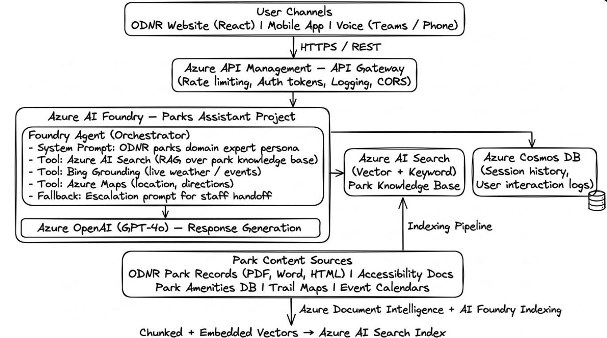

# Ohio Department of Natural Resources — Division of Parks and Watercraft
## AI Initiative: Implementation Plan & Architectural Design

> **Agency:** Ohio Department of Natural Resources (ODNR) — Division of Parks and Watercraft  
> **Platform:** Microsoft Azure AI Foundry + Azure AI Services  
> **Date:** March 2026  

---

## Table of Contents

1. [Executive Summary](#executive-summary)
2. [Solution Overview](#solution-overview)
3. [Use Case 1 — Watercraft Customer Data Merge](#use-case-1--watercraft-customer-data-merge)
   - [Problem Statement](#problem-statement)
   - [Architecture](#architecture-uc1)
   - [Implementation Plan](#implementation-plan-uc1)
   - [Azure Services](#azure-services-uc1)
4. [Use Case 2 — AI Enabled State Parks Assistant](#use-case-2--ai-enabled-state-parks-assistant)
   - [Problem Statement](#problem-statement-uc2)
   - [Architecture](#architecture-uc2)
   - [Implementation Plan](#implementation-plan-uc2)
   - [Azure Services](#azure-services-uc2)
5. [Shared Platform Architecture](#shared-platform-architecture)
6. [Security & Compliance](#security--compliance)
7. [Implementation Roadmap](#implementation-roadmap)
8. [Success Metrics & KPIs](#success-metrics--kpis)
9. [Cost Estimates](#cost-estimates)
10. [Team & Roles](#team--roles)

---

## Executive Summary

The Ohio Department of Natural Resources (ODNR), Division of Parks and Watercraft, is initiating two high-priority AI use cases aimed at modernizing operations and improving public service delivery. These initiatives leverage **Microsoft Azure AI Foundry** as the unified AI development and orchestration platform, complemented by targeted **Azure AI Services** to deliver scalable, secure, and maintainable solutions aligned with Ohio's public-sector cloud standards.

| Initiative | Problem | AI Solution | Outcome |
|---|---|---|---|
| Watercraft Customer Data Merge | 2M+ records with high duplicate rate from legacy systems | AI-powered entity resolution and deduplication pipeline | Cleaner, consistent customer master data |
| AI Enabled State Parks Assistant | Residents and staff rely on manual lookups / call centers | RAG-based conversational AI with park knowledge base | 24/7 natural language park information access |

---

## Solution Overview

Both use cases share a common Azure AI Foundry project workspace with role-based isolation, enforcing data governance and monitoring from a single pane of glass. The architecture follows a **Hub-and-Spoke** model:

```
┌─────────────────────────────────────────────────────────────────┐
│                   Azure AI Foundry Hub                          │
│  (Shared: Model Catalog, Monitoring, Connections, Policies)     │
│                                                                 │
│   ┌─────────────────────┐   ┌─────────────────────────────┐    │
│   │  Project Spoke A    │   │      Project Spoke B        │    │
│   │  Data Merge         │   │  Parks Assistant            │    │
│   │  (Watercraft)       │   │  (Public-facing RAG)        │    │
│   └─────────────────────┘   └─────────────────────────────┘    │
└─────────────────────────────────────────────────────────────────┘
```

---

## Use Case 1 — Watercraft Customer Data Merge

### Problem Statement

The Division holds **over 2 million customer records** accumulated across multiple legacy watercraft registration and licensing systems. Duplicate records degrade data quality and force staff to perform manual reconciliation, impacting billing accuracy, audit readiness, and compliance with Ohio's watercraft registration mandates.

**Root Causes:**
- Multiple ingestion pathways (paper forms, third-party kiosks, state portals)
- No historical master data management (MDM) strategy
- Name/address variations across entry channels (abbreviations, misspellings, format differences)

---

### Architecture (UC1)


---

### Implementation Plan (UC1)

#### Phase 1 — Discovery & Data Assessment (Weeks 1–4)
- [ ] Conduct data profiling across all source systems with contract provider
- [ ] Identify duplicate rate, field completeness, and data quality scoring
- [ ] Document source system schemas and field mapping
- [ ] Establish data governance policies (retention, PII handling, FERPA/PII classification)
- [ ] Provision Azure landing zone (resource groups, VNets, Key Vault, RBAC)

#### Phase 2 — Data Pipeline Design (Weeks 5–8)
- [ ] Configure Azure Data Factory pipelines for legacy source ingestion
- [ ] Implement Bronze/Silver/Gold medallion architecture in ADLS Gen2
- [ ] Build normalization transformations (name standardization, address parsing)
- [ ] Set up Azure Purview for data catalog and lineage tracking
- [ ] Enable row-level security and column masking for PII fields

#### Phase 3 — AI Model Development (Weeks 9–14)
- [ ] Deploy Azure AI Foundry project workspace for the Data Merge initiative
- [ ] Configure Azure OpenAI (GPT-4o) endpoint within Foundry for record adjudication
- [ ] Build Prompt Flow orchestration:
  - Step 1: Candidate pair generation (blocking strategy by ZIP + last name)
  - Step 2: Feature extraction (name similarity, DOB match, address geocode)
  - Step 3: LLM-based reasoning for ambiguous pairs (confidence < 0.85)
  - Step 4: Auto-merge for high-confidence matches (≥ 0.95) or flag for human review
- [ ] Implement audit logging to Azure Table Storage (every merge decision + rationale)
- [ ] Build Power Apps human review queue for exception handling

#### Phase 4 — Pilot Implementation (Weeks 15–18)
- [ ] Run pilot against a 10% sample (~200K records)
- [ ] Evaluate precision/recall against manually verified ground truth set
- [ ] Tune confidence thresholds and model prompts based on results
- [ ] User acceptance testing with Division data staff

#### Phase 5 — Full Scale Production & Training (Weeks 19–24)
- [ ] Full 2M+ record processing run (batch mode via ADF triggers)
- [ ] Configure scheduled recurring deduplication (monthly cadence)
- [ ] Staff training on Power Apps review queue and Power BI dashboards
- [ ] Incident response runbook and model monitoring setup
- [ ] Documentation and knowledge transfer to ODNR IT

---

### Azure Services (UC1)

| Service | Role |
|---|---|
| **Azure AI Foundry** | Unified project workspace, model catalog, Prompt Flow orchestration, monitoring |
| **Azure OpenAI Service (GPT-4o)** | Ambiguous record reasoning, merge decision rationale generation |
| **Azure AI Language** | Named entity recognition for name/address normalization |
| **Azure Data Factory** | ELT pipelines from legacy source systems |
| **Azure Data Lake Storage Gen2** | Bronze/Silver/Gold data zones |
| **Azure Databricks** | Large-scale transformation and feature engineering |
| **Azure SQL Database** | Customer master golden record store |
| **Azure Purview** | Data catalog, lineage, and PII classification |
| **Azure Key Vault** | Secrets management (connection strings, API keys) |
| **Power Apps** | Human review queue for exception records |
| **Power BI** | Merge analytics and data quality reporting dashboard |
| **Azure Monitor + App Insights** | Pipeline health monitoring and alerting |

---

## Use Case 2 — AI Enabled State Parks Assistant

### Problem Statement (UC2)

Ohio's state parks system encompasses **74 parks** across the state, each with unique amenities, accessibility features, seasonal schedules, pet policies, and contact information. Residents and visitors currently rely on fragmented web pages and call centers for discovery. This creates friction in the user experience and unnecessary operational burden on ODNR staff.

**Goals:**
- Natural language query interface accessible via web, mobile, and voice
- Conversational answers grounded in authoritative ODNR park records
- 24/7 availability without staff intervention for common inquiries
- Data capture on popular queries to guide future park investments

---

### Architecture (UC2)



---

### Implementation Plan (UC2)

#### Phase 1 — Content Inventory & Knowledge Base Design (Weeks 1–4)
- [ ] Audit all ODNR park record sources (PDFs, HTML pages, spreadsheets, databases)
- [ ] Define content taxonomy: amenities, accessibility, hours, fees, contacts, events
- [ ] Establish content governance model (approval workflow for knowledge base updates)
- [ ] Design Azure AI Search index schema (fields, semantic configuration, vector dimensions)
- [ ] Provision Azure AI Foundry project, AI Search instance, Cosmos DB, API Management

#### Phase 2 — Knowledge Base Ingestion Pipeline (Weeks 5–9)
- [ ] Deploy Azure Document Intelligence for PDF/Word park record extraction
- [ ] Build data pipeline to chunk, embed (text-embedding-3-large), and index park content
- [ ] Configure Azure AI Search with:
  - Hybrid retrieval (keyword + vector semantic ranking)
  - Semantic ranker enabled
  - Filters: park name, county, amenity type, accessibility flags
- [ ] Validate retrieval quality against 50 representative test queries
- [ ] Set up incremental indexing trigger (Azure Function on blob upload)

#### Phase 3 — Foundry Agent & Conversational Layer (Weeks 10–15)
- [ ] Configure Foundry Agent with GPT-4o deployment
- [ ] Author system prompt with ODNR domain persona, content boundaries, and citation instructions
- [ ] Register tools in the agent: Azure AI Search, Azure Maps, Bing Grounding
- [ ] Implement multi-turn conversation with Cosmos DB session persistence
- [ ] Build escalation logic: if agent confidence is low, generate staff referral response with contact details
- [ ] Implement responsible AI content filters (Azure AI Content Safety)
- [ ] Create REST API wrapper via Azure API Management with OAuth 2.0 / Entra ID auth

#### Phase 4 — Channel Integration (Weeks 16–19)
- [ ] Integrate REST API with ODNR website (React front-end chat widget)
- [ ] Build Teams bot channel via Azure Bot Service for internal staff use
- [ ] Evaluate voice channel integration (Azure Communication Services or Nuance)
- [ ] Conduct accessibility audit (WCAG 2.1 AA compliance for web widget)

#### Phase 5 — Pilot, Training & Rollout (Weeks 20–24)
- [ ] Soft launch to pilot user group (park staff + volunteer testers)
- [ ] Collect feedback via post-conversation survey widget
- [ ] Tune retrieval and prompt based on feedback and query analytics
- [ ] Train ODNR content team on knowledge base update process
- [ ] Full public launch with monitoring dashboards live
- [ ] Quarterly review cadence for content refresh and model evaluation

---

### Azure Services (UC2)

| Service | Role |
|---|---|
| **Azure AI Foundry** | Agent orchestration, Prompt Flow, model deployment, evaluation |
| **Azure OpenAI Service (GPT-4o)** | Natural language response generation |
| **Azure OpenAI (text-embedding-3-large)** | Vector embeddings for park content chunks |
| **Azure AI Search** | Hybrid vector + keyword retrieval over park knowledge base |
| **Azure Document Intelligence** | Extraction of content from PDFs and scanned park docs |
| **Azure AI Content Safety** | Input/output filtering for responsible AI guardrails |
| **Azure Cosmos DB** | Conversation history, session state, and interaction analytics |
| **Azure API Management** | Gateway: rate limiting, auth, logging, versioning |
| **Azure Bot Service** | Teams channel integration for internal staff assistant |
| **Azure Maps** | Location lookup, directions, proximity search |
| **Bing Grounding (via Foundry)** | Real-time park events, weather context |
| **Azure Monitor + App Insights** | Query analytics, latency monitoring, usage reporting |
| **Azure Communication Services** | Optional: voice channel for phone-based assistant |
| **Microsoft Entra ID** | Identity and access management for staff-facing channels |

---

## Shared Platform Architecture

Both use cases are deployed under a single **Azure AI Foundry Hub** with project-level isolation, sharing the following platform components:

```
┌─────────────────────────────────────────────────────────────────────┐
│                    Shared Platform Services                         │
│                                                                     │
│  ┌────────────────────────────────────────────────────────────┐    │
│  │  Microsoft Entra ID — Unified Identity & RBAC              │    │
│  └────────────────────────────────────────────────────────────┘    │
│  ┌────────────────────────────────────────────────────────────┐    │
│  │  Azure Key Vault — Centralized Secrets & Key Management    │    │
│  └────────────────────────────────────────────────────────────┘    │
│  ┌────────────────────────────────────────────────────────────┐    │
│  │  Azure Monitor + Log Analytics Workspace                   │    │
│  │  (Unified operational logs, alerts, and dashboards)        │    │
│  └────────────────────────────────────────────────────────────┘    │
│  ┌────────────────────────────────────────────────────────────┐    │
│  │  Azure Policy + Defender for Cloud                         │    │
│  │  (Compliance guardrails, threat protection)                │    │
│  └────────────────────────────────────────────────────────────┘    │
│  ┌────────────────────────────────────────────────────────────┐    │
│  │  Azure Virtual Network + Private Endpoints                 │    │
│  │  (All PaaS services on private network)                    │    │
│  └────────────────────────────────────────────────────────────┘    │
└─────────────────────────────────────────────────────────────────────┘
```

### Resource Group Structure

```
rg-odnr-parks-shared        # Foundry Hub, Key Vault, VNet, Monitor
rg-odnr-parks-datamerge     # UC1: Data Factory, ADLS, Databricks, SQL
rg-odnr-parks-assistant     # UC2: AI Search, Cosmos DB, API Management, Bot Service
```

---

## Security & Compliance

| Control | Implementation |
|---|---|
| **Identity** | Microsoft Entra ID with MFA; Managed Identities for service-to-service auth |
| **Network** | All Azure PaaS services on private endpoints; no public internet exposure for backend |
| **Data Encryption** | At-rest: AES-256 (Azure-managed keys); In-transit: TLS 1.2+ |
| **PII Protection** | Azure Purview PII classification; column-level masking in SQL; AI Content Safety filters |
| **Audit Logging** | All model decisions logged (Foundry tracing + Azure Table Storage); 7-year retention |
| **Access Control** | Azure RBAC with least-privilege; separate service principals per project |
| **Responsible AI** | Azure AI Content Safety; Foundry evaluation suite for bias and groundedness checks |
| **Compliance** | Ohio Data Protection Law; NIST 800-53 controls mapped; FedRAMP-aligned Azure regions |

---

## Implementation Roadmap

```
Month  1   2   3   4   5   6
       ├───┼───┼───┼───┼───┤

UC1 — Data Merge
Discovery   ████
Pipeline         ████
AI Dev                ████████
Pilot                         ████
Production                        ████████

UC2 — Parks Assistant
Content     ████
KB Build         ████████
Agent Dev                 ████████
Channels                          ████
Rollout                               ████
```

| Milestone | Target Month | Owner |
|---|---|---|
| Azure AI Foundry Hub provisioned | Month 1 | ODNR IT + Microsoft |
| UC1 Data assessment complete | Month 1 | ODNR Data Team + Contract Provider |
| UC1 Bronze/Silver/Gold pipeline live | Month 2 | Data Engineering |
| UC2 Park knowledge base indexed | Month 2 | Content Team + AI Engineering |
| UC1 Pilot (200K records) | Month 4 | Data Team + AI Engineering |
| UC2 Internal pilot (staff) | Month 4 | Product + UX |
| UC1 Full production run | Month 5 | Data Team |
| UC2 Public launch | Month 6 | ODNR Product + IT |
| Monthly deduplication cadence live | Month 6 | Data Engineering |

---

## Success Metrics & KPIs

### UC1 — Watercraft Customer Data Merge

| Metric | Baseline | Target |
|---|---|---|
| Estimated duplicate rate | ~15–20% (TBD in discovery) | < 2% post-merge |
| Manual review time per batch | N/A (first run) | < 5% of records requiring human review |
| Merge precision | N/A | ≥ 97% (validated against ground truth) |
| Merge recall | N/A | ≥ 93% |
| Time to process full 2M records | N/A (manual) | < 48 hours (batch) |
| Monthly dedup cycle time | Manual / ad-hoc | < 4 hours automated |

### UC2 — AI Enabled State Parks Assistant

| Metric | Baseline | Target |
|---|---|---|
| Call center contacts for park info | Current volume (TBD) | 25% reduction in 12 months |
| User satisfaction score | N/A | ≥ 4.2 / 5.0 |
| Query resolution rate (no escalation) | N/A | ≥ 80% |
| Average response latency | N/A | < 3 seconds (P95) |
| Knowledge base coverage (parks) | 0% | 100% of 74 Ohio state parks |
| Monthly active users | 0 | 5,000+ within 6 months |

---

## Cost Estimates

> Cost estimates are indicative and should be refined during proof-of-concept sizing with Azure Pricing Calculator.

### UC1 — Data Merge (One-Time + Recurring Monthly)

| Component | Estimated Monthly Cost |
|---|---|
| Azure OpenAI (GPT-4o) — processing 2M records | ~$2,000–$4,000 (one-time initial run) |
| Azure Databricks (transformation) | ~$500–$1,500 |
| Azure Data Factory (pipeline runs) | ~$200–$400 |
| Azure Data Lake Storage Gen2 | ~$100–$200 |
| Azure SQL (Customer Master) | ~$300–$600 |
| Azure Purview | ~$200–$400 |
| **Recurring monthly (dedup cycle)** | **~$800–$1,500/month** |

### UC2 — Parks Assistant (Monthly Operational)

| Component | Estimated Monthly Cost |
|---|---|
| Azure OpenAI (GPT-4o) — 50K queries/month | ~$800–$1,500 |
| Azure AI Search (S1 tier) | ~$250/month |
| Azure API Management (Standard) | ~$300/month |
| Azure Cosmos DB | ~$100–$200 |
| Azure Bot Service | ~$50–$100 |
| Application Insights + Monitor | ~$100–$200 |
| **Total estimated monthly** | **~$1,600–$2,550/month** |

---

## Team & Roles

| Role | Responsibility |
|---|---|
| **ODNR IT Lead** | Azure environment owner, governance, RBAC, network |
| **AI Engineer (Microsoft / Partner)** | Foundry configuration, Prompt Flow, agent development |
| **Data Engineer** | ADF pipelines, medallion architecture, SQL schema |
| **Data Analyst** | Ground truth validation, KPI tracking, Power BI |
| **Content Curator (ODNR)** | Park knowledge base content, approval workflows |
| **UX Designer** | Chat widget design, accessibility compliance |
| **Contract Data Provider** | Legacy system extraction, initial data profiling |
| **Microsoft CSE / FastTrack** | Architecture guidance, Foundry onboarding, review |

---

## Getting Started

### Prerequisites

- Azure Subscription with Owner or Contributor role
- Microsoft Entra ID tenant
- Azure AI Foundry access enabled on subscription
- GitHub repository access (this repo)

### Provision the Foundry Hub

```bash
# Log in to Azure
az login

# Create resource groups
az group create --name rg-odnr-parks-shared --location eastus2
az group create --name rg-odnr-parks-datamerge --location eastus2
az group create --name rg-odnr-parks-assistant --location eastus2

# Deploy Azure AI Foundry Hub (via portal or bicep — see /infra folder)
az deployment group create \
  --resource-group rg-odnr-parks-shared \
  --template-file ./infra/foundry-hub.bicep \
  --parameters hubName=odnr-parks-ai-hub location=eastus2
```

### Repository Structure

```
oh-parkwc/
├── README.md                          # This document
├── infra/                             # Infrastructure as Code (Bicep)
│   ├── foundry-hub.bicep
│   ├── data-merge/
│   └── parks-assistant/
├── src/
│   ├── data-merge/                    # UC1: Pipelines, Prompt Flows
│   │   ├── pipelines/
│   │   ├── prompt-flows/
│   │   └── notebooks/
│   └── parks-assistant/               # UC2: Agent, indexing, API
│       ├── agent/
│       ├── indexing/
│       └── api/
├── docs/
│   ├── architecture/
│   ├── data-governance/
│   └── runbooks/
└── tests/
    ├── data-merge/
    └── parks-assistant/
```

---

## References

- [Azure AI Foundry Documentation](https://learn.microsoft.com/azure/ai-foundry/)
- [Azure OpenAI Service](https://learn.microsoft.com/azure/ai-services/openai/)
- [Azure AI Search — RAG Patterns](https://learn.microsoft.com/azure/search/retrieval-augmented-generation-overview)
- [Azure AI Content Safety](https://learn.microsoft.com/azure/ai-services/content-safety/)
- [Responsible AI at Microsoft](https://www.microsoft.com/ai/responsible-ai)
- [Ohio Cybersecurity & Data Privacy Standards](https://ohio.gov/wps/portal/gov/site/government/resources/ohio-cybersecurity/)

---

*Document maintained by ODNR Division of Parks and Watercraft AI Initiative team. For questions, contact the ODNR IT Office.*
