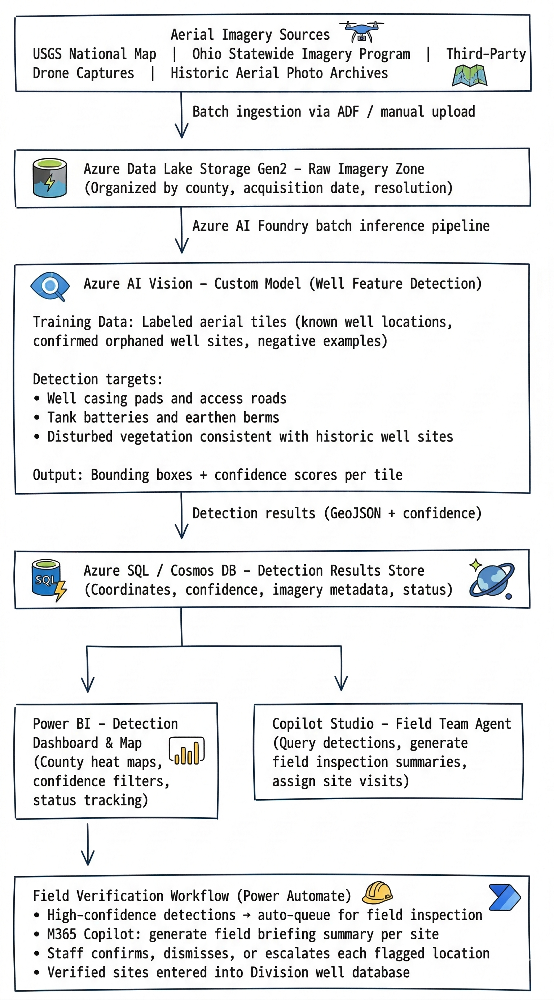

# Ohio Department of Natural Resources — Division of Oil & Gas Resources Management
## AI Initiative: Implementation Plan & Architectural Design

> **Agency:** Ohio Department of Natural Resources (ODNR) — Division of Oil & Gas Resources Management
> **Platform:** Microsoft Azure AI Foundry + Azure AI Services + Microsoft Power Platform
> **Date:** March 2026

---

## Table of Contents

1. [Executive Summary](#executive-summary)
2. [Solution Overview](#solution-overview)
3. [Use Case 1 — Identifying Orphaned Wells via Aerial Images](#use-case-1--identifying-orphaned-wells-via-aerial-images)
   - [Problem Statement](#problem-statement)
   - [Architecture (UC1)](#architecture-uc1)
   - [Implementation Plan (UC1)](#implementation-plan-uc1)
   - [Microsoft & Azure Services (UC1)](#microsoft--azure-services-uc1)
4. [Use Case 2 — Historic Files Processing](#use-case-2--historic-files-processing)
   - [Problem Statement (UC2)](#problem-statement-uc2)
   - [Architecture (UC2)](#architecture-uc2)
   - [Implementation Plan (UC2)](#implementation-plan-uc2)
   - [Microsoft & Azure Services (UC2)](#microsoft--azure-services-uc2)
5. [Shared Platform Architecture](#shared-platform-architecture)
6. [Security & Compliance](#security--compliance)
7. [Implementation Roadmap](#implementation-roadmap)
8. [Success Metrics & KPIs](#success-metrics--kpis)
9. [Cost Estimates](#cost-estimates)
10. [Team & Roles](#team--roles)

---

## Executive Summary

The Ohio Department of Natural Resources (ODNR), Division of Oil & Gas Resources Management, is pursuing two AI-enabled initiatives to address longstanding environmental monitoring challenges and legacy data accessibility gaps. Both use cases are built on the **Microsoft Azure AI** platform, combining computer vision, document intelligence, and workflow automation to deliver scalable, auditable solutions aligned with Ohio's public-sector cloud standards.

| Initiative | Problem | AI Solution | Outcome |
|---|---|---|---|
| UC1 — Orphaned Well Detection | Orphaned wells are difficult to locate manually from the ground; aerial imagery is voluminous and unanalyzed | Azure AI Vision custom model scans aerial imagery to detect well surface features; findings routed to field teams | Higher detection rates, reduced field inspection time, improved environmental monitoring |
| UC2 — Historic Files Processing | Legacy oil & gas records exist in scanned documents and microfiche; inaccessible for modern analysis and compliance | Azure AI Document Intelligence with OCR extracts metadata; M365 Copilot summarizes content; records made searchable | Digitized, searchable historic record archive supporting compliance, research, and regulatory reporting |

---

## Solution Overview

Both use cases leverage a shared Azure AI Foundry platform deployed within ODNR's Azure subscription. A common data lake and observability layer reduces duplication and supports cross-initiative governance.

```
┌──────────────────────────────────────────────────────────────────┐
│            ODNR Azure AI Foundry Hub (Shared)                    │
│                                                                  │
│  ┌───────────────────────┐   ┌──────────────────────────────┐   │
│  │  UC1 — Orphaned Well  │   │  UC2 — Historic Records      │   │
│  │  Image Detection      │   │  Digitization Pipeline       │   │
│  └───────────────────────┘   └──────────────────────────────┘   │
│                                                                  │
│  Shared: ADLS Gen2 | Key Vault | Monitor | Entra ID | Purview   │
└──────────────────────────────────────────────────────────────────┘
```

---

## Use Case 1 — Identifying Orphaned Wells via Aerial Images

### Problem Statement

Ohio has thousands of legacy oil and gas wells, many of which have been abandoned without proper plugging. These **orphaned wells** pose significant environmental and public safety risks — including methane emissions, groundwater contamination, and physical hazards. Locating them is a priority for the Division, but traditional field-based surveys are slow, expensive, and limited in geographic coverage.

High-resolution aerial and satellite imagery is increasingly available at scale, but manual review of thousands of image tiles by staff is impractical. AI-powered image recognition can automate the detection of surface features associated with orphaned wells — including well casings, tank batteries, access roads, and disturbed earth patterns — at a fraction of the cost and time of manual methods.

---

### Architecture (UC1)




### Implementation Plan (UC1)

#### Phase 1 — Scope Definition & Data Collection (Weeks 1–4)
- [ ] Define target regions for pilot (select 2–3 Ohio counties with known orphaned well concentrations)
- [ ] Identify aerial imagery sources: USGS National Map, Ohio Statewide Imagery Program, existing Division drone captures
- [ ] Establish success criteria: target detection precision/recall rates, coverage goals
- [ ] Collect labeled training dataset: known well locations (positive), confirmed non-well tiles (negative)
- [ ] Assess imagery resolution requirements for reliable well feature detection
- [ ] Provision Azure landing zone: ADLS Gen2, AI Foundry project, Key Vault

#### Phase 2 — Model Training & Validation (Weeks 5–10)
- [ ] Label training imagery in Azure AI Vision Studio (bounding box annotation per well feature type)
- [ ] Train custom Azure AI Vision object detection model on labeled dataset
- [ ] Evaluate model performance: precision, recall, F1 on held-out validation set
- [ ] Iterate on training data and model parameters to meet accuracy thresholds
- [ ] Design confidence scoring strategy: auto-queue threshold (≥ 0.85) vs. manual review queue
- [ ] Establish false-positive review process with Division geologists

#### Phase 3 — Detection Pipeline & Workflow Build (Weeks 11–16)
- [ ] Build Azure AI Foundry batch inference pipeline:
  - ADF ingestion of imagery tiles from ADLS Gen2
  - Batch scoring against custom Azure AI Vision model
  - GeoJSON detection result output with coordinates + confidence
- [ ] Deploy detection results database (Azure SQL with spatial indexing)
- [ ] Build Power Automate field verification workflow:
  - High-confidence detections auto-queue for field inspection assignment
  - M365 Copilot generates field briefing summary per site (coordinates, imagery context, nearby known wells)
  - Staff review and verification step in model-driven Power App
- [ ] Build Copilot Studio field team agent:
  - Query detections by county, confidence, status
  - Generate inspection assignment summaries
  - Update site status after field visit
- [ ] Build Power BI detection dashboard with county heat maps, confidence filters, and status tracking

#### Phase 4 — Field Validation & Model Refinement (Weeks 17–20)
- [ ] Field teams verify top 50–100 high-confidence detections in pilot counties
- [ ] Compare AI detections to field-confirmed sites; measure true positive rate
- [ ] Feed confirmed and dismissed detections back into model retraining dataset
- [ ] Refine model and confidence thresholds based on field feedback
- [ ] UAT with Division inspectors and GIS staff

#### Phase 5 — Scale Planning & Rollout (Weeks 21–24)
- [ ] Expand detection pipeline to all Ohio counties statewide
- [ ] Establish recurring detection cadence (quarterly imagery refresh)
- [ ] Integrate verified orphaned well detections into Division well database
- [ ] Staff training on Power BI dashboard, Copilot Studio agent, and field briefing workflow
- [ ] Document model performance, detection methodology, and QA process for regulatory reporting

---

### Microsoft & Azure Services (UC1)

| Service | Role |
|---|---|
| **Azure AI Vision (Custom Model)** | Object detection model for orphaned well surface feature identification in aerial imagery |
| **Azure AI Foundry** | Model training management, batch inference pipeline, monitoring |
| **Azure Data Lake Storage Gen2** | Raw aerial imagery storage organized by county and acquisition date |
| **Azure Data Factory** | Batch ingestion of imagery tiles; pipeline orchestration |
| **Azure SQL Database** | Spatial detection results store (coordinates, confidence, status) |
| **Microsoft Power Automate** | Field verification routing workflow; inspection assignment queuing |
| **Microsoft 365 Copilot** | Field briefing summary generation per detected site |
| **Copilot Studio** | Field team conversational agent for querying detections and managing site visits |
| **Power BI** | Detection dashboard with county heat maps, confidence filters, and status tracking |
| **Power Apps (Model-Driven)** | Staff review queue for detection verification and disposition |
| **Azure Maps** | Spatial visualization of detection coordinates on Ohio county maps |
| **Azure Monitor + App Insights** | Pipeline health monitoring, model inference latency, alerting |

---

## Use Case 2 — Historic Files Processing

### Problem Statement (UC2)

The Division of Oil & Gas Resources Management maintains an extensive archive of historic records — well logs, drilling reports, completion records, production data, inspection files — many of which exist only as **scanned documents or microfiche**. These records:

- Cannot be searched electronically in their current form
- Require manual retrieval and physical review by staff
- Are at risk of degradation over time
- Block compliance reporting and historical research that depends on legacy data

Digitizing and indexing this archive with AI-powered document intelligence will make decades of regulatory and operational data accessible, searchable, and usable for modern environmental analysis, compliance verification, and historical research.

---

### Architecture (UC2)


### Implementation Plan (UC2)

#### Phase 1 — Scope & Inventory (Weeks 1–3)
- [ ] Inventory all historic record types, formats, and estimated volumes
- [ ] Select 2–3 high-priority document types for pilot (e.g., well completion reports, drilling permits)
- [ ] Define metadata extraction targets per document type
- [ ] Establish baseline: current retrieval time per record, estimated backlog volume
- [ ] Assess digitization pipeline for microfiche (scanner vendor integration or pre-digitized TIFF availability)
- [ ] Provision Azure resources: ADLS Gen2, Document Intelligence, Azure SQL, AI Search

#### Phase 2 — Document Intelligence Model Training (Weeks 4–8)
- [ ] Collect representative sample documents for each selected record type
- [ ] Label training documents in Document Intelligence Studio (field annotation per document type)
- [ ] Train custom extraction models per document type
- [ ] Validate extraction accuracy on held-out sample (target: ≥ 90% field-level accuracy for pilot types)
- [ ] Implement confidence threshold logic: auto-populate (≥ 0.90) vs. staff review queue (< 0.90)
- [ ] Design Azure SQL schema and Azure AI Search index for extracted metadata and full-text content

#### Phase 3 — Pipeline & Integration Build (Weeks 9–14)
- [ ] Build Power Automate pipeline:
  - File arrival trigger (ADLS Gen2 or SharePoint intake folder)
  - Call Document Intelligence API per document type
  - Route high-confidence extractions to Azure SQL / Dataverse
  - Route low-confidence extractions to Power App staff review queue
  - Index full document text in Azure AI Search
- [ ] Configure M365 Copilot integration for plain-language document summaries
- [ ] Build Copilot Studio records research agent:
  - Natural language queries over the historic archive
  - Filter by county, well ID, operator, date range, document type
  - Surface AI-generated document summaries alongside raw records
- [ ] Build Power App staff review interface for low-confidence field correction

#### Phase 4 — Testing & Validation (Weeks 15–18)
- [ ] Process full pilot sample through end-to-end pipeline
- [ ] Compare extraction accuracy against manually verified ground truth
- [ ] UAT with Division geologists, compliance staff, and records management team
- [ ] Validate Copilot Studio agent query accuracy against known records
- [ ] Refine extraction models and search index configuration

#### Phase 5 — Scale Rollout & Backlog Processing (Weeks 19–24)
- [ ] Expand pipeline to all prioritized historic document types
- [ ] Begin systematic backlog processing (batched by document type and time period)
- [ ] Establish ongoing ingestion process for newly scanned documents
- [ ] Staff training on Copilot Studio research agent and Power App review queue
- [ ] Document extraction methodology, confidence thresholds, and QA process
- [ ] Set up model retraining cadence as new document types are onboarded

---

### Microsoft & Azure Services (UC2)

| Service | Role |
|---|---|
| **Azure AI Document Intelligence** | Custom OCR and metadata extraction models for historic oil & gas records |
| **Azure AI Search** | Full-text and semantic search index over extracted document content |
| **Microsoft Power Automate** | Pipeline trigger, Document Intelligence API calls, routing to review queue or database |
| **Microsoft 365 Copilot** | Plain-language summary generation for extracted documents |
| **Copilot Studio** | Natural language records research agent for Division staff |
| **Azure Data Lake Storage Gen2** | Raw scanned document landing zone (organized by type, year, well ID) |
| **Azure SQL Database** | Structured metadata store (well ID, operator, county, dates, formations) |
| **Microsoft Dataverse** | Optional: structured record storage integrated with Power Apps ecosystem |
| **Power Apps (Canvas)** | Staff review interface for low-confidence field correction |
| **Azure AI Language** | Entity recognition and validation on extracted free-text fields |
| **Azure Monitor + App Insights** | Pipeline throughput monitoring, extraction accuracy dashboards, alerting |
| **Azure Purview** | Data catalog and lineage tracking for the digitized archive |

---

## Shared Platform Architecture

Both use cases share a common Azure AI Foundry hub, data lake, and observability layer. This reduces infrastructure duplication and provides unified governance across both initiatives.

- Azure AI Foundry Hub with UC1 Well Detection and UC2 Historic Records project isolation.
- Azure Key Vault for secrets management; Microsoft Purview for data catalog, lineage, and PII classification.
- Azure Monitor and Log Analytics for unified observability; Azure Virtual Network with Private Endpoints.
- Microsoft Entra ID with managed identities; Azure Policy and Defender for Cloud compliance guardrails.

```
┌──────────────────────────────────────────────────────────────────────┐
│                  Shared Platform Services                            │
│                                                                      │
│  ┌──────────────────────────────────────────────────────────────┐   │
│  │  Microsoft Entra ID — Identity, RBAC, Conditional Access     │   │
│  └──────────────────────────────────────────────────────────────┘   │
│  ┌──────────────────────────────────────────────────────────────┐   │
│  │  Azure Key Vault — Secrets & API Key Management              │   │
│  └──────────────────────────────────────────────────────────────┘   │
│  ┌──────────────────────────────────────────────────────────────┐   │
│  │  Azure Monitor + Log Analytics — Unified Observability       │   │
│  └──────────────────────────────────────────────────────────────┘   │
│  ┌──────────────────────────────────────────────────────────────┐   │
│  │  Azure Purview — Data Catalog, Lineage & PII Classification  │   │
│  └──────────────────────────────────────────────────────────────┘   │
│  ┌──────────────────────────────────────────────────────────────┐   │
│  │  Azure Virtual Network + Private Endpoints                   │   │
│  └──────────────────────────────────────────────────────────────┘   │
└──────────────────────────────────────────────────────────────────────┘
```

### Resource Group Structure

```
rg-odnr-oilgas-shared        # AI Foundry Hub, Key Vault, VNet, Monitor, Purview
rg-odnr-oilgas-welldetect    # UC1: AI Vision, ADF, ADLS, SQL (detections), Power BI
rg-odnr-oilgas-histrecords   # UC2: Document Intelligence, AI Search, SQL (metadata), ADLS
```

---

## Security & Compliance

| Control | Implementation |
|---|---|
| **Identity** | Microsoft Entra ID with MFA; Managed Identities for service-to-service auth; Conditional Access |
| **Network** | All Azure PaaS services on private endpoints; no public internet exposure for backend |
| **Data Encryption** | At-rest: AES-256 (Azure-managed keys); In-transit: TLS 1.2+ |
| **Historic Record Sensitivity** | Azure Purview PII/sensitive data classification; role-based access control per document type |
| **Aerial Imagery Handling** | Imagery stored in ADLS Gen2 with private access; no public exposure of detection coordinates |
| **Audit Logging** | All model inference decisions logged (AI Foundry tracing + Azure Monitor); 7-year retention |
| **Human-in-the-Loop** | Field verification required before orphaned well database entry; staff confirms all extracted metadata |
| **Compliance** | Ohio Data Protection Law; NIST 800-53 control mapping; FedRAMP-aligned Azure regions; EPA reporting requirements for orphaned well programs |

---

## Implementation Roadmap

```
Month     1     2     3     4     5     6
          ├─────┼─────┼─────┼─────┼─────┤

Shared    ████ (Foundry Hub, ADLS, shared infra — Month 1)

UC1       ████  ████████  ████████████  ████  ████████
          Scope Training  Pipeline      Field Scale

UC2       ████  ████████  ██████████████  ████  ████████
          Scope DocIntel  Pipeline+Search  UAT   Backlog
```

| Milestone | Target Month | Owner |
|---|---|---|
| Azure AI Foundry Hub + shared infra provisioned | Month 1 | ODNR IT |
| UC1 Training imagery collected and labeled | Month 2 | AI Engineer + GIS |
| UC2 Document Intelligence models trained (pilot types) | Month 2 | AI Engineer |
| UC1 Custom AI Vision model trained and validated | Month 3 | AI Engineer |
| UC1 Detection pipeline + Power BI dashboard live | Month 3 | Data / Platform Engineer |
| UC2 Power Automate pipeline + AI Search index live | Month 4 | Platform Engineer |
| UC1 Field validation complete (pilot counties) | Month 4 | Field Inspectors |
| UC2 UAT + Copilot Studio agent validated | Month 4 | Division Staff |
| UC1 Statewide detection run | Month 5 | AI Engineer |
| UC2 Backlog processing begins (full document types) | Month 5 | Data Engineering |
| Both use cases in steady-state operation | Month 6 | All teams |

---

## Success Metrics & KPIs

### UC1 — Orphaned Well Detection

| Metric | Baseline | Target |
|---|---|---|
| Detection precision (field-confirmed / AI-flagged) | N/A | ≥ 80% |
| Detection recall (AI-found / total known sites) | N/A | ≥ 75% |
| Field inspection time per confirmed well (pre-AI) | Manual survey (TBD) | ≥ 40% reduction |
| Image tiles processed per week | 0 (manual) | 10,000+ automated |
| New orphaned wells identified (pilot counties) | Baseline TBD | Measurable increase vs. manual methods |
| Detection-to-inspection turnaround time | Days to weeks | < 3 business days |

### UC2 — Historic Files Processing

| Metric | Baseline | Target |
|---|---|---|
| Time to retrieve a specific historic record | Minutes to hours (manual) | < 30 seconds (search) |
| Field-level extraction accuracy (pilot document types) | N/A | ≥ 90% |
| % records requiring staff correction | N/A | < 15% |
| Records digitized per month | 0 (manual scanning only) | 2,000+ per month (automated pipeline) |
| Historic archive searchability | 0% (analog) | 100% of ingested records full-text searchable |
| Staff hours saved per month on record retrieval | Baseline TBD | ≥ 25 hrs/month |

---

## Cost Estimates

> Estimates are indicative. Validate with the [Azure Pricing Calculator](https://azure.microsoft.com/pricing/calculator/) based on finalized imagery volumes and document backlog size.

### UC1 — Orphaned Well Detection

| Component | Monthly Estimate (Steady State) |
|---|---|
| Azure AI Vision (custom model inference, ~50K tiles/month) | $300–$700 |
| Azure Data Factory (imagery ingestion) | $100–$250 |
| Azure Data Lake Storage Gen2 (imagery + results) | $200–$500 |
| Azure SQL Database (detections store) | $150–$300 |
| Power BI Premium (detection dashboard) | $0–$200 (if existing license) |
| Azure Maps | $50–$100 |
| Azure Monitor + App Insights | $50–$100 |
| **UC1 Total** | **~$850–$2,150/month** |

### UC2 — Historic Files Processing

| Component | Build Period (Months 1–6) | Monthly Steady State |
|---|---|---|
| Azure AI Document Intelligence (~10K pages/month) | $200–$500 | $100–$300 |
| Azure AI Search (S1 tier) | ~$250 | ~$250 |
| Azure SQL Database (metadata store) | $150–$300 | $150–$300 |
| Azure Data Lake Storage Gen2 (document archive) | $100–$300 | $50–$150 |
| Power Automate Premium flows | $150–$300 | $150–$300 |
| Copilot Studio (per session) | $100–$300 | $100–$300 |
| Azure Monitor + App Insights | $50–$100 | $50–$100 |
| **UC2 Total** | **~$1,000–$2,050/month** | **~$850–$1,700/month** |

### Combined Estimate

| Scenario | Monthly Cost |
|---|---|
| **Build period (Months 1–6)** | ~$2,000–$4,500/month |
| **Post-launch steady state** | **~$1,700–$3,850/month** |
| **Annual operational estimate** | **~$20,000–$46,000/year** |

---

## Team & Roles

| Role | Count | UC | Primary Responsibility | Required Skills |
|---|---|---|---|---|
| **AI / Computer Vision Engineer** | 1 | UC1 | Azure AI Vision model training, annotation, batch inference pipeline | Azure AI Vision, Python, image labeling, object detection, Azure AI Foundry |
| **AI / Document Intelligence Engineer** | 1 | UC2 | Document Intelligence model training, extraction pipeline, AI Search indexing | Azure AI Document Intelligence, OCR, Python, Azure AI Search |
| **Data / Platform Engineer** | 1 | UC1 + UC2 | ADLS Gen2, ADF pipelines, Azure SQL schema, Purview catalog | Azure Data Factory, ADLS Gen2, Azure SQL, Azure Purview, Bicep/ARM |
| **Power Platform Developer** | 1 | UC1 + UC2 | Power Automate flows, Power Apps review queues, Copilot Studio agents | Power Automate, Power Apps, Copilot Studio, Dataverse, REST connectors |
| **GIS Specialist** | 1 | UC1 | Imagery source identification, spatial data handling, detection coordinate validation | GIS, spatial SQL, aerial imagery, USGS data sources |
| **Division Geologist / Records SME** | 1 | UC1 + UC2 | Field detection validation, historic record metadata review, domain accuracy | Oil & gas geology, well log interpretation, Division record systems |
| **Business Analyst** | 0.5 | UC1 + UC2 | Requirements, process mapping, UAT coordination, baseline metrics | Business analysis, workflow documentation |
| **ODNR IT Lead** | 0.5 | UC1 + UC2 | Azure subscription, Entra ID, VNet, environment governance | Azure administration, network, M365 |

---

## Getting Started

### Prerequisites

- Azure Subscription with Owner or Contributor role
- Azure AI Foundry access enabled on subscription
- Access to Ohio Statewide Imagery Program data or USGS National Map
- Historic document backlog assessment completed
- Microsoft 365 tenant with Power Platform and Copilot Studio enabled

### Provision the Shared Infrastructure

```bash
az login

# Create resource groups
az group create --name rg-odnr-oilgas-shared     --location eastus2
az group create --name rg-odnr-oilgas-welldetect --location eastus2
az group create --name rg-odnr-oilgas-histrecords --location eastus2

# Deploy shared infrastructure
az deployment group create \
  --resource-group rg-odnr-oilgas-shared \
  --template-file ./infra/oilgas-shared.bicep \
  --parameters hubName=odnr-oilgas-ai-hub location=eastus2
```

### Repository Structure

```
oh-parkwc/oilgas/
├── README.md                          # This document
├── EXECUTIVE-SUMMARY.md               # Executive summary
├── infra/                             # Azure Infrastructure as Code
│   ├── oilgas-shared.bicep
│   ├── uc1-welldetect/
│   └── uc2-histrecords/
├── src/
│   ├── uc1-well-detection/
│   │   ├── model-training/            # Labeling config, training scripts
│   │   ├── inference-pipeline/        # ADF + batch scoring
│   │   └── field-workflow/            # Power Automate, Copilot Studio
│   └── uc2-historic-records/
│       ├── document-intelligence/     # Model definitions, labeling
│       ├── pipeline/                  # Power Automate flows
│       └── search/                   # AI Search index config
├── docs/
│   ├── architecture/
│   ├── data-governance/
│   └── runbooks/
└── tests/
    ├── uc1-well-detection/
    └── uc2-historic-records/
```

---

## References

- [Azure AI Vision Documentation](https://learn.microsoft.com/azure/ai-services/computer-vision/)
- [Azure AI Document Intelligence Documentation](https://learn.microsoft.com/azure/ai-services/document-intelligence/)
- [Azure AI Search — Retrieval & Indexing](https://learn.microsoft.com/azure/search/)
- [Azure AI Foundry Documentation](https://learn.microsoft.com/azure/ai-foundry/)
- [Microsoft Power Automate Documentation](https://learn.microsoft.com/power-automate/)
- [EPA Orphaned Well Program](https://www.epa.gov/natural-gas-star-program/methane-from-orphaned-wells)
- [Ohio Orphaned Well Program — ODNR](https://ohiodnr.gov/discover-and-learn/safety-conservation/about-odnr/oil-gas/orphaned-well-program)
- [Responsible AI at Microsoft](https://www.microsoft.com/ai/responsible-ai)

---

*Document maintained by ODNR Division of Oil & Gas Resources Management AI Initiative team. For questions, contact the ODNR IT Office.*
